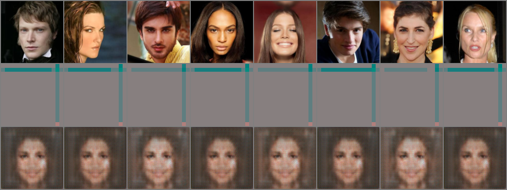

# Stable Diffusion Report

In stable diffusion, you must train two different components, the autoencoder and the diffusion model. 

* Autoencoder to compress the high resolution image into something less computationally required for generation later on. 
* Diffusion model to learnt to generate an image in the latent space from noise. 
This report goes over the history and progress of generating a non-existing image. 

For each models, the following general steps were followed:

1. Find a set of hyperparameter configuration that generally works on about 30 epochs. 
2. Hyperparameter Optimize (Sweep) centered around that found hyperparameter configuration. The target loss after 10 epochs is recorded (with the exception of early stopping pruning)
3. The optimized configuration is trained for 50 or 100 epochs.


## AutoEncoder

Vector-Quantized Variational Auto-Encoder (VQVAE) was used to convert images into smaller sized latent images. VQVAE leveraged codebook look up that discretized latent values and allowed a more representative latent space of the original image. The autoencoder first encodes the image into a pre-quantized latent image, quantize through looking-up pixel-embedding to the nearest codebook embedding, and decode the post-quantized latent image where the losses are calculated. To ensure the pre-quantized pixel-embedding does not stray too far from the embedding, codebook+commitment losses are calculated and backpropagated along with the image-related losses.  

### Hyperparameter Optimization:

??? "Sweep Configurations (Hyperparameter range)"
    ```yaml
    program: "src/train_ddpm.py"
    name: sweep_ddpm
    method: bayes
    metric:
    name: "Validation/Loss-ddpm"
    goal: minimize

    parameters:
    models.diffusion.down_channels:
        values:
        - [256, 384, 512, 768]
        - [128, 256, 512, 768]
        - [64, 128, 512, 768]
    models.diffusion.mid_channels:
        values:
        - [768, 512]
        - [768, 512, 512]
    models.diffusion.t_emb_dim:
        distribution: q_log_uniform_values
        min: 128
        max: 1024
    models.diffusion.num_down_layers:
        distribution: int_uniform
        min: 1
        max: 4
    models.diffusion.num_mid_layers:
        distribution: int_uniform
        min: 1
        max: 4
    models.diffusion.num_up_layers:
        distribution: int_uniform
        min: 1
        max: 4
    models.diffusion.num_heads:
        values: [2, 4, 8, 16, 32]
    models.diffusion.conv_out_channels:
        distribution: q_log_uniform_values
        min: 32
        max: 512
        q: 32

    noise_scheduler.num_timesteps:
        distribution: q_log_uniform_values
        min: 500
        max: 3000
    noise_scheduler.beta_start:
        distribution: log_uniform_values
        min: 1e-5
        max: 1e-3
    noise_scheduler.beta_end:
        distribution: log_uniform_values
        min: 1e-3
        max: 1e-1
    ddpm.lr:
        distribution: log_uniform_values
        min: 1e-6
        max: 1e-3
    datamodule.batch_size:
        distribution: q_log_uniform_values
        min: 16
        max: 128

    early_terminate:
    type: "hyperband"
    min_iter: 3

    command:
    - ${env}
    - ${interpreter}
    - ${program}
    - ${args_no_hyphens}
    
    ```

#### Adversarial Losses
{ width="300" }
/// caption

///

#### Codebook and Commitment Losses
{ width="300" }
/// caption

///

#### Perceptual Losses
{ width="300" }
/// caption

///

#### Reconstruction Losses
{ width="300" }  
/// caption
///

### Notable Sweep Configurations

The following are some notable directions the vqvae began to learn the dataset to latent space conversion.

#### Run 1: 2025-06-05_02-06-18
{ width="400" }
/// caption
Comparing the original image (top row), latent image (middle row), reconstructed image (bottom row) for run 1: 2025-06-05_02-06-18. Epoch: 10
///

??? "Parameter Configurations (Run 1)"
    ```yaml
    datamodule:
      batch_size: 16
    models:
      autoencoder:
        beta: 0.031434697351974974
        down_channels: [16, 64, 128, 256]
        embedding_dim: 6
        num_down_layers: 4
        num_mid_layers: 1
        num_up_layers: 1
        num_embeddings: 3708
        num_heads: 4
      discriminator:
        conv_channels: [16, 32, 64]
    systems:
      loss_weights:
        adversarial: 0.02277441690906937
        internal: 18.28967516429656
        perceptual: 0.0002447386292215411
        reconst: 0.14919996447016615
    lr:
      d: 3.6026788983424064e-06
      g: 3.6362412179266015e-05
    ```

It can be noted that the reconstructed images in this run displays a generic face failing to generate any unique features for each image. The output shows a 'mean' or 'averaged' face, common when the autoencoder is not able to capture distinct features and resort to a single averaged face where the loss is the lowest for all images. 

A reason for this failure is likely due to the high internal loss weight of 18.29, compared to the other loss weights of adversarial, perceptual and reconstruction where they are 0.023, 0.00024, and 0.15 respectively. The dominant internal loss (the sum of codebook and commitment loss with beta=0.03) renders the visual losses negligible which focuses the autoencoder in learning a stable yet meaningless codebook. This as a result teaches the model to produce a safe and averaged image to the overly stablized latent space.  

#### Run 2: 2025-06-05_03-23-41
{ width="400" }
/// caption
Comparing the original image (top row), latent image (middle row), reconstructed image (bottom row) for run 2: 2025-06-05_03-23-41. Epoch: 10
///

??? "Parameter Configurations (Run 2)"
    ```yaml
    datamodule:
      batch_size: 16
    models:
      autoencoder:
        beta: 0.07830023604089383
        down_channels: [16, 64, 128, 256]
        embedding_dim: 6
        num_down_layers: 4
        num_mid_layers: 2
        num_up_layers: 2
        num_embeddings: 2327
        num_heads: 2
      discriminator:
        conv_channels: [64, 128, 256, 512]
    systems:
      loss_weights:
        adversarial: 0.00008909160625646387
        internal: 0.0823042928039229
        perceptual: 0.002681812647958391
        reconst: 90.66739309587147
    lr:
      d: 3.637625577905393e-06
      g: 3.637665086781343e-05
    ```

Run 2 shows improvement in reconstruction quality in-comparison to the previous run 1. The output images are relatively recognizable - showing uniquness to a certain extent - indicating the latent space holds a form of original image information. With that said, the reconstructed images lacks detail and appears to be blurry. The latent images displays extreme colors which could suggest the models inability to encode and compress the image in a meaningful manner. 

Blurry images are common in high reconstruction loss weight as the MSELoss focuses on structure and color (where models commonly lean towards average pixel values), and fails to capture high-frequency details. The latent image's appears to be noisy as the codebook embeddings is disorganized and is used in a patch-by-patch manner in solving the pixel-matching puzzle instead of abstract features. Furthermore, the perceptual and adversarial losses are far too insignficiant for the model to weight importance on sharp and realistic textures. The model in this case is more of a pixel matcher than a image compressor preserving important information. 

#### Run 3: 2025-06-05_05-12-17
{ width="400" }
/// caption
Comparing the original image (top row), latent image (middle row), reconstructed image (bottom row) for run 3: 2025-06-05_05-12-17. Epoch: 10
///

??? "Parameter Configurations (Run 3)"
    ```yaml
    datamodule:
      batch_size: 16
    models:
      autoencoder:
        beta: 0.033203203889255975
        down_channels: [16, 64, 128, 256]
        embedding_dim: 6
        num_down_layers: 2
        num_mid_layers: 2
        num_up_layers: 2
        num_embeddings: 5377
        num_heads: 32
      discriminator:
        conv_channels: [16, 32, 64]
    systems:
      loss_weights:
        adversarial: 0.0002824064862999839
        internal: 8.710494682214064
        perceptual: 0.0002784928081396848
        reconst: 0.5440532552186204
    lr:
      d: 1.424399124491354e-06
      g: 0.00010944209261365034
    ```

The results in run3 is the best so far. Despite the color imbalance, each reconstructed image maintains the structural and peceptual detail of the original. We may observe the codebook embeddings in the latent images holding less variance in values compared to run2 and run4, which implies the strength that is being applied to the codebook+commitment losses.

The issue in run 3 is mainly the  imbalanaced loss weighting, where similar to run 1, the internal loss is the most dominant. The difference between the losses is not as severe in this case, allowing a more accurate sharp reconstruction, but primarily lacks in coloring and the reconstruction seems to be more faded out / brown-ish tinted. Indicating the reconstruction loss could be weighted more to focus on color. The dominant internal loss preoccupies the model to focus o n codeboook usage rather than the image quality. This configuration has a high codebook capacity with 5377 number of embeddings and a 32-headed attention mechanism which should effectively capture features as they do much better comparing the run 2. 

#### Run 4: 2025-06-05_08-52-13
{ width="400" }
/// caption
Comparing the original image (top row), latent image (middle row), reconstructed image (bottom row) for run 4: 2025-06-05_08-52-13. Epoch: 10
///

??? "Parameter Configurations (Run 4)"
    ```yaml
    datamodule:
      batch_size: 64
    models:
      autoencoder:
        beta: 0.6443345881327225
        down_channels: [32, 64, 128, 256]
        embedding_dim: 5
        num_down_layers: 1
        num_mid_layers: 4
        num_up_layers: 2
        num_embeddings: 4014
        num_heads: 4
      discriminator:
        conv_channels: [64, 128, 256]
    systems:
      loss_weights:
        adversarial: 0.7760262788835401
        internal: 4.333458542618579
        perceptual: 0.0012227879638211584
        reconst: 65.10522954739554
    lr:
      d: 9.227559277019527e-06
      g: 0.0014256583051953369
    ```

Run4 had the best configuration out of the tested ones. We may also observe this from the comparison image above. The images produced substantially sharper and retains more details with accurate color reconstruction. The model is able to capture facial expressions, positions, and textural details like hair. The latent images appears to be vibrant and distinctly structured, indication good latent compression. Similar to run 3, the latent images visibly correspond to the input feature semantics (face, eyes, hair, and clothes).

The reason of this apparent success is due to a good, balanced, and effective configuration of losses and model architecture. Even though the reconstruction loss is weighted high, strong adversarial weight contributed to ensure human-like features taking advantage and unravelling from what is learned by discriminator. 

### Final Model


### Sweep Configuration

## Denoising Diffusion Probabilitic Model 

### Hyperparameter Optimization

{ width="300" } { width="300" }

### Notable Sweep Configuration

Out of the 30 or so run trials, I ran 2 of the best configurations up until 100 epochs. The results are the following.

#### Run1: Giddy Grass 43
{ width="300" } 
{ width="300" }

??? "Hyperparameter Configuration"
    ```yaml
    datamodule:
      batch_size: 56
      num_workers: 4
    ddpm:
      lr: 0.00013256608655142174
    models:
      diffusion:
        conv_out_channels: 352
        down_channels:
          - 256
          - 384
          - 512
          - 768
        mid_channels:
          - 768
          - 512
        num_down_layers: 1
        num_mid_layers: 2
        num_up_layers: 4
        num_heads: 2
        t_emb_dim: 309
    noise_scheduler:
      beta_start: 0.00010505422393815704
      beta_end: 0.06392103975835639
      num_timesteps: 2617
    ```

#### Run2: Eager Sound 42
{ width="300" }
{ width="300" }

??? "Hyperparameter Configuration"
    ```yaml
    datamodule:
      batch_size: 25
      num_workers: 4
    ddpm:
      lr: 7.016014614095296e-06
    models:
      diffusion:
        conv_out_channels: 336
        down_channels:
          - 128
          - 256
          - 512
          - 768
        mid_channels:
          - 768
          - 512
          - 512
        num_down_layers: 1
        num_mid_layers: 4
        num_up_layers: 1
        num_heads: 4
        t_emb_dim: 743
    noise_scheduler:
      beta_start: 0.000986132869834486
      beta_end: 0.08828010703949035
      num_timesteps: 929
    ```

## Conclusion
Oh my god I just noticed I needed to quantize the final output for the best final results. 


